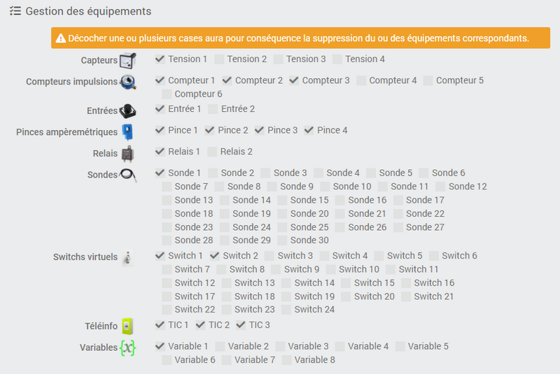

# WES Control Plugin

Mit diesem Plugin können Sie die Kontrolle über Ihr Plugin übernehmen [**CartElectronic WES-Energieserver**](https://www.cartelectronic.fr/content/8-serveur-wes){:target = "\_ blank"} und stellen Sie alle Daten sofort in Jeedom wieder her.    

# Allgemeine Konfiguration

## Plugin Konfiguration

Wie jedes Jeedom-Plugin auch das Plugin **Wes Kontrolle** muss nach der Installation aktiviert werden.

Das Plugin **Wes Kontrolle** verwendet einen eigenen Daemon, um in ständigem Kontakt mit dem Wes-Server zu bleiben. Sie können den Status auf der Plugin-Konfigurationsseite überprüfen.

>**TRICK**
>    
>Es ist nicht erforderlich, sich über den Status des Dämons Gedanken zu machen, sobald das Plugin aktiviert wird, da durch die Erstellung der ersten Wes-Serverausrüstung der Dämon automatisch konfiguriert und gestartet wird.

Das Plugin erfordert keine bestimmte Konfiguration, bietet jedoch ein Feld, in dem Sie die Verzögerung in Sekunden zwischen zwei Abfragen des Wes-Servers auswählen können. *(Standardmäßig 30 Sekunden)*

>**WICHTIG**
>    
>Wenn Sie diesen Wert verringern und eine Trägheit oder Instabilität des Systems feststellen, kehren Sie zum Standardwert zurück *(30)*.

## Konfiguration der Wes-Serverausrüstung

Zugriff auf die verschiedenen Geräte **Wes Kontrolle**, Gehe zum Menü **Plugins → Energie → Wes Control**.    

>**INFORMATION**
>    
>Die Taste **+ Hinzufügen** Mit dieser Option können Sie einen neuen Wes-Server hinzufügen.

Nachdem Sie Ihre Wes-Serverausrüstung erstellt haben, klicken Sie darauf, um auf die Zugriffskonfiguration sowie die Verwaltung der Geräte / Funktionen zuzugreifen.     

Geben Sie die allgemeinen Informationen des Geräts ein und geben Sie an, ob an das Wes ein optionales Gerät angeschlossen ist, z. B. ein Bildschirm oder ein 9-Volt-Netzteil zur Messung der Netzspannung, indem Sie die entsprechenden Kontrollkästchen aktivieren.

Geben Sie dann die Zugriffsinformationen zum Wes-Server in HTTP ein, um mit ihm kommunizieren zu können :
- **Wes IP** : IP-Adresse, unter der der Wes-Server erreichbar ist.
- **Hafen der Wes** *(facultatif)* : Port, an dem der Wes-Server erreichbar ist *(80 standardmäßig)*.
- **HTTP-ID** : Kennung für die Kommunikation in HTTP mit dem Wes-Server.
- **HTTP-Passwort** : Passwort für die Kommunikation in HTTP mit dem Wes-Server.

Das Plugin **Wes Kontrolle** Enthält eine Datei, die speziell für Jeedom entwickelt wurde und den Zugriff auf mehr Daten ermöglicht, als normalerweise standardmäßig verfügbar sind. Es ist erforderlich, eine FTP-Verbindung mit dem Wes-Server herzustellen, um diese Datei zu übertragen. Daher müssen auch die folgenden Felder ausgefüllt werden :
- **FTP-ID** : Kennung für die Kommunikation in FTP mit dem Wes-Server.
- **FTP-Passwort** : Passwort für die FTP-Kommunikation mit dem Wes-Server.
- **Jeedom CGX-Datei** : Aktivieren Sie das Kontrollkästchen, um die Jeedom CGX-Datei zu verwenden.
- **CG-Datei sendenX** : Nachdem Sie die FTP-Verbindungsinformationen eingegeben haben, klicken Sie auf diese Schaltfläche, um die Datei sofort auf die Wes zu übertragen.

>**INFORMATION**
>
>Verbindungsinformationen zum Wes-Server können über die Wes-Internetschnittstelle im Menü angezeigt werden **Konfiguration → Sicherer Zugriff**.

## Geräte- / Funktionsmanagement

Das Teil **Gerätemanagement** Hier können Sie die Funktionen des Wes zum Aktivieren / Deaktivieren auswählen.

Jeder **Kästchen angekreuzt** wird darin enden, dass **automatische Erstellung der entsprechenden Ausrüstung**, und umgekehrt, **jedes Kästchen deaktiviert** wird darin enden, dass **automatisches Löschen der entsprechenden Ausrüstung** :     

# Ausstattung / Funktionskonfiguration

Zurück zur allgemeinen Seite des Plugins **Wes Kontrolle**, Zuvor aktivierte Geräte werden nach Servern gruppiert und in Akkordeonmenüs sortiert, die nach Art der Funktionalität klassifiziert sind.   

Das Suchfeld ermöglicht die sofortige Visualisierung der benötigten Ausrüstung. Rechts bricht das kreuzförmige Symbol die Suche ab, der geöffnete Ordner entfaltet alle Menüs und der geschlossene Ordner faltet das Ganze zusammen.

>**TRICK**
>
>Es ist möglich, jedes Menü in der Liste neu zu organisieren, indem Sie darauf klicken und es an der gewünschten Stelle positionieren.

Wenn Sie wie gewohnt auf ein Gerät klicken, gelangen Sie zu dessen Konfigurationsseite, auf der Sie allgemeine Informationen eingeben und die Liste der Bestellungen anzeigen können.

## Optionale Ausstattungsparameter

Einige Geräte verfügen über zusätzliche Konfigurationsparameter, die bei der Aktivierung eingegeben werden müssen.

Diese Parameter können die Art der Messung sein, die für Stromzangen durchgeführt werden soll *(Verbrauch oder Produktion)* oder die elektrische Abonnementformel für Teleinfo zum Beispiel.

Andere können sich auf die Auswahl eines bestimmten Hardwaretyps beziehen, um die veranschaulichenden Bilder des Geräts wie den Typ des Pulsmessers anzupassen *(Wasser, Gas, Gas)* oder die Art der verwendeten Stromzange *(20 Ampere oder 100 Ampere)* unter anderen.

## WES-Schnittstelle

Auf jeder Ausrüstungsseite (einschließlich der Wes-Serverausrüstung) befindet sich oben rechts eine blaue Schaltfläche mit dem Namen **Wes Schnittstelle** Hiermit können Sie die Weboberfläche des Wes-Servers in einem neuen Tab Ihres Browsers öffnen.

Abhängig von der Art der Ausrüstung, auf der Sie sich befinden, werden Sie automatisch zu der dieser Funktion entsprechenden Schnittstellenseite weitergeleitet.

# Kommende Entwicklungen

Das Team arbeitet bereits an der Integration der derzeit nicht unterstützten Wes-Erweiterungen wie der 8-Relais- oder Modbus-Erweiterung und wird sein Bestes tun, um das Plugin so schnell wie möglich in diese Richtung zu entwickeln.
