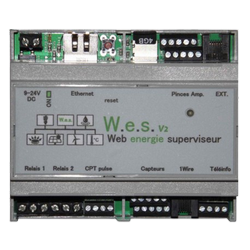

# Complemento WES Control

Este complemento le permitirá tomar el control de su [**Servidor de energía electrónico WES**](https://www.cartelectronic.fr/content/8-serveur-wes){:target = "\_ blank"} y recupera todos los datos instantáneamente en Jeedom.

>**IMPORTANTE**
>
>Al estar este material en constante evolución, el complemento en versión estable ofrece compatibilidad total con servidores Wes con firmware inferior a `V0.84A10` y la versión beta con firmware mayor o igual a `V0.84A10`.

# Configuración general

## Configuración del complemento

Como cualquier complemento de Jeedom, el complemento **Wes control** debe activarse después de la instalación.

El complemento **Wes control** utiliza su propio demonio para mantenerse en contacto constante con el servidor Wes. Puede verificar el estado en la página de configuración del complemento.

>**INFORMACIÓN**
>
>No es necesario preocuparse por el estado del demonio tan pronto como se active el complemento porque la creación del equipo del servidor 1st Wes configurará e iniciará automáticamente el demonio.

El complemento no requiere ninguna configuración en particular pero ofrece un campo que permite elegir el retraso en segundos entre 2 interrogaciones del servidor Wes. *(30 segundos por defecto)*

>**IMPORTANTE**
>
>Si reduce este valor y experimenta lentitud o inestabilidad del sistema, vuelva al valor predeterminado *(30)*.

## Configuración del equipo servidor Wes

Para acceder a los diferentes equipos **Wes control**, ir al menú **Complementos → Energía → Wes Control**.

>**INFORMACIÓN**
>
>El botón **+ Agregar** le permite agregar un nuevo servidor Wes.

Después de haber creado su equipo servidor Wes, haga clic en él para acceder a la configuración de acceso así como a la gestión de equipos / funcionalidades.

Complete la información general del equipo y luego indique si tiene un equipo opcional conectado al Wes como una pantalla o una fuente de alimentación de 9 voltios para medir la tensión de red marcando las casillas correspondientes.

Luego, complete la información de acceso al servidor Wes en HTTP para poder comunicarse con él :
- **IP de Wes** : Dirección IP en la que se puede acceder al servidor Wes.
- **Puerto del Wes** *(facultatif)* : puerto en el que se puede acceder al servidor Wes *(80 por defecto)*.
- **ID de HTTP** : identificador utilizado para comunicarse en HTTP con el servidor Wes.
- **Contraseña HTTP** : contraseña utilizada para comunicarse en HTTP con el servidor Wes.

El complemento **Wes control** incluye un archivo especialmente diseñado para Jeedom y que permite el acceso a más datos de los que normalmente están disponibles por defecto. Es necesario establecer una conexión FTP con el servidor Wes para transferir este archivo, por lo tanto, los siguientes campos también deben completarse :
- **ID de FTP** : identificador utilizado para comunicarse en FTP con el servidor Wes.
- **Contraseña FTP** : contraseña utilizada para comunicarse en FTP con el servidor Wes.
- **Archivo Jeedom CGX** : marque la casilla para usar el archivo Jeedom CGX.
- **Enviar archivo CGX** : Una vez que se haya ingresado la información de la conexión FTP, haga clic en este botón para transferir inmediatamente el archivo al Wes.

>**INFORMACIÓN**
>
>La información de conexión al servidor Wes se puede ver desde la interfaz de Internet Wes en el menú **Configuración → Acceso seguro**.

## Gestión de equipos / funcionalidad

La parte **Gestión de equipos** le permitirá seleccionar las características del Wes para activar / desactivar.

Cada **casilla marcada** resultará en **creación automática del equipo correspondiente**, y por el contrario, **cada casilla sin marcar** resultará en **borrado automático del equipo correspondiente** :

# Equipo / configuración funcional

Volver a la página general del complemento **Wes control**, los dispositivos activados previamente se agrupan por servidor y se ordenan en menús de acordeón clasificados por tipo de funcionalidad.

El campo de búsqueda permite la visualización inmediata del equipo requerido. A la derecha, el icono en forma de cruz cancela la búsqueda, la carpeta abierta despliega todos los menús y la carpeta cerrada pliega todo.

>**TRUCO**
>
>Es posible reorganizar cada menú en la lista si hace clic en él mientras lo coloca en la ubicación deseada.

Como es habitual, al hacer clic en un elemento del equipo, se accede a su página de configuración, lo que le permite ingresar información general y ver la lista de pedidos.

## Parámetros de equipos opcionales

Algunos dispositivos tienen parámetros de configuración adicionales que deben ingresarse al activarlos.

Estos parámetros pueden ser el tipo de medición que se tomará para las pinzas amperimétricas *(consumo o producción)* o la fórmula de suscripción eléctrica relativa a teleinfo, por ejemplo.

Otros pueden relacionarse con la selección de un tipo específico de hardware para personalizar las imágenes ilustrativas del equipo, como el tipo de medidor de pulsos *(agua, gas, gas)* o el tipo de pinza amperimétrica utilizada *(20 amperios o 100 amperios)* entre otro.

## Interfaz WES

En cada página de equipo (incluido el equipo del servidor Wes) hay, en la parte superior derecha, un botón azul llamado **Interfaz Wes** que le permite abrir la interfaz web del servidor Wes en una nueva pestaña de su navegador.

Dependiendo del tipo de equipo en el que se encuentre, será redirigido automáticamente a la página de interfaz correspondiente a esta función.

# Próximos desarrollos

El equipo ya está trabajando en la integración de las extensiones Wes actualmente no compatibles, como el relé 8 o la extensión modbus, y hará todo lo posible para desarrollar el complemento en esta dirección lo antes posible.
