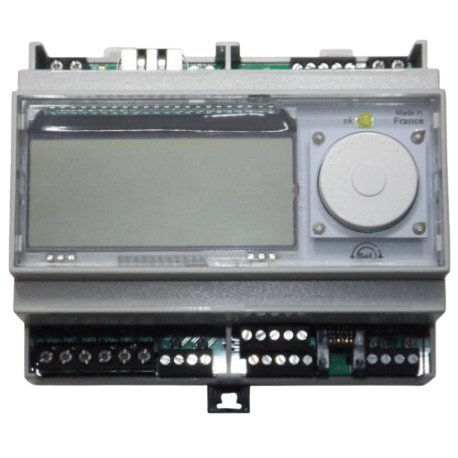
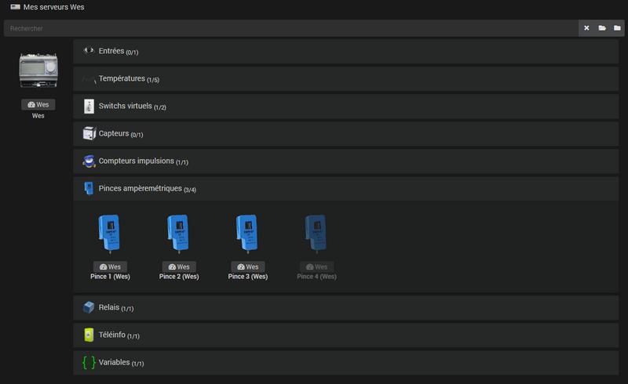
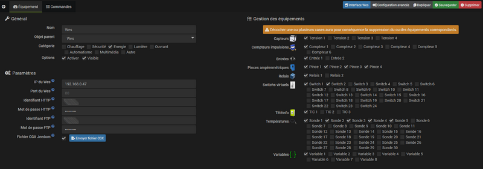
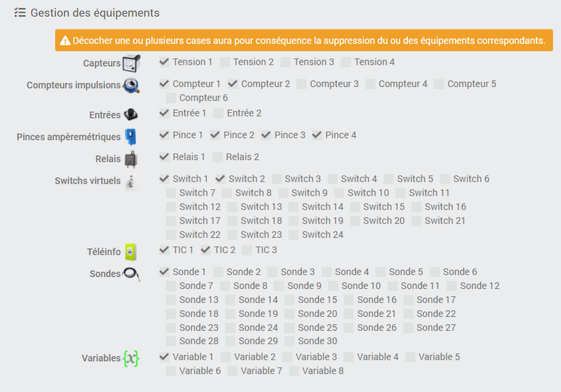
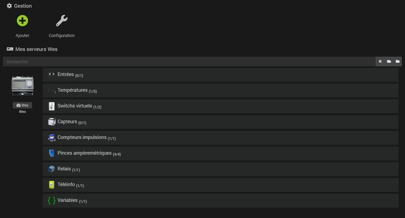

# Plugin WES Control

# Description

Ce plugin va vous permettre de prendre le contrôle de votre [**serveur d'énergie WES de CartElectronic**](https://www.cartelectronic.fr/content/8-serveur-wes){:target="\_blank"} et d'en récupérer toutes les données instantanément dans Jeedom.    

# Configuration

## Configuration du plugin

Comme tout plugin Jeedom, le plugin **Wes Control** doit être activé après l'installation.

Le plugin **Wes Control** utilise son propre démon afin de rester en contact constant avec le serveur Wes. Vous pouvez en contrôler le statut sur la page de configuration du plugin.

>**ASTUCE**
>    
>Il n'est pas nécessaire de se préoccuper de l'état du démon dès l'activation du plugin car la création du 1er équipement serveur Wes va automatiquement configurer et démarrer le démon.

Le plugin ne nécessite pas de configuration particulière mais propose un champ permettant de choisir le délai en secondes entre 2 interrogations du serveur Wes. *(30 secondes par défaut)*

>**IMPORTANT**
>    
>Vous avez la possibilité d'interroger votre serveur Wes jusqu'à chaque seconde si vous le souhaitez. Si vous constatez des lenteurs ou une instabilité du système, revenez à la valeur par défaut *(30)*.

## Configuration de l'équipement serveur Wes

Pour accéder aux différents équipements **Wes Control**, dirigez-vous vers le menu **Plugins → Energie → Wes Control**.    

>**INFORMATION**
>    
>Le bouton **+ Ajouter** permet d'ajouter un nouveau serveur Wes.

Après avoir créé votre équipement serveur Wes, cliquez sur celui-ci pour accéder à la configuration des accès ainsi qu'à la gestion des équipements/fonctionnalités.     

Renseignez les informations générales de l'équipement puis indiquez les informations d'accès au serveur Wes en HTTP :
- **IP du Wes** : adresse IP sur laquelle le serveur Wes est joignable.
- **Port du Wes** *(facultatif)* : port sur lequel le serveur Wes est joignable *(80 par défaut)*.
- **Identifiant HTTP** : identifiant permettant de communiquer en HTTP avec le serveur Wes.
- **Mot de passe HTTP** : mot de passe permettant de communiquer en HTTP avec le serveur Wes.

Le plugin **Wes Control** intègre un fichier spécialement conçu pour Jeedom et permettant d'avoir accès à davantage de données que celles disponibles normalement par défaut. Il est nécessaire d'établir une connexion FTP avec le serveur Wes pour y transférer ce fichier, les champs suivants doivent donc être complétés également :
- **Identifiant FTP** : identifiant permettant de communiquer en FTP avec le serveur Wes.
- **Mot de passe FTP** : mot de passe permettant de communiquer en FTP avec le serveur Wes.
- **Fichier CGX Jeedom** : cocher la case pour utiliser le fichier CGX Jeedom.
- **Envoyer fichier CGX** : Une fois les informations de connexion FTP renseignées, cliquez sur ce bouton pour transférer immédiatement le fichier sur le Wes.

>**informations**
>
>Les informations de connexion au serveur Wes sont consultables depuis l'interface internet du Wes dans le menu **Configuration → Accès sécurisé**.

## Gestion des équipements/fonctionnalités

La partie **Gestion des équipements** va vous permettre de sélectionner les fonctionnalités du Wes à activer/désactiver.

Chaque **case cochée** aura pour conséquence la **création automatique de l'équipement correspondant**, et à l'inverse, **chaque case décochée** aura pour conséquence la **suppression automatique de l'équipement correspondant** :     

# Navigation dans les équipements/fonctionnalités

De retour sur la page générale du plugin **Wes Control**, les équipements activés précédemment sont regroupés par serveur et triés dans des menus déroulants classés par type de fonctionnalité.    

Comme à l'habitude, le clic sur un équipement vous amène sur sa page de configuration permettant de renseigner les informations générales et de visualiser la liste des commandes.

>**ASTUCE**
>
>Le champs de recherche permet la visualisation immédiate de l'équipement recherché. Sur la droite, l'icone en forme de croix annule la recherche, le dossier ouvert déplie tous les menus et le dossier fermé replie l'ensemble.

# Paramètres optionnels des équipements

Certains équipements sont dotés de paramètres complémentaires qu'il faudra renseigner lors de leur activation.

Ces paramètres peuvent être le type de mesure à relever pour des pinces ampèremétriques *(consommation ou production)* ou la formule d'abonnement électrique concernant la téléinfo par exemple.   
