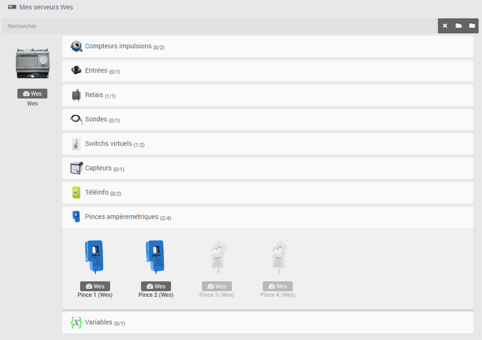

# Plug-in de controle do WES

Este plugin permitirá que você assuma o controle de seu [**Servidor de energia CartElectronic WES**](https://www.cartelectronic.fr/content/8-serveur-wes){:target = "\_ blank"} e recupere todos os dados instantaneamente no Jeedom.

>**IMPORTANTE**
>
>Este material estando em constante evolução, o plugin em versão estável oferece total compatibilidade com servidores Wes com firmware inferior a `V0.84A10` e a versão beta com firmware maior ou igual a `V0.84A10`.

# Configuração geral

## Configuração de plug-in

Como qualquer plugin Jeedom, o plugin **Controle Wes** deve ser ativado após a instalação.

O plugin **Controle Wes** usa seu próprio daemon para ficar em contato constante com o servidor Wes. Você pode verificar o status na página de configuração do plugin.

>**EM FORMAÇÃO**
>
>Não é necessário se preocupar com o estado do daemon assim que o plugin for ativado porque a criação do 1º servidor Wes irá configurar automaticamente e iniciar o daemon.

O plugin não requer nenhuma configuração particular mas oferece um campo que permite escolher o atraso em segundos entre 2 interrogações do servidor Wes. *(30 segundos por padrão)*

>**IMPORTANTE**
>
>Se você diminuir este valor e experimentar lentidão ou instabilidade do sistema, reverta para o valor padrão *(30)*.

## Configuração do equipamento servidor Wes

Para acessar os diferentes equipamentos **Controle Wes**, vá para o menu **Plugins → Energia → Controle Wes**.

>**EM FORMAÇÃO**
>
>O botão **acrescentar** permite que você adicione um novo servidor Wes.

Após ter criado seu equipamento servidor Wes, clique nele para acessar a configuração de acesso bem como o gerenciamento de equipamentos / funcionalidades.

Preencha as informações gerais do equipamento e indique se você tem algum equipamento opcional conectado ao Wes, como uma tela ou uma fonte de alimentação de 9 volts para medir a tensão da rede, marcando as caixas correspondentes.

Em seguida, preencha as informações de acesso ao servidor Wes em HTTP para poder se comunicar com ele :
- **IP de Wes** : Endereço IP no qual o servidor Wes pode ser encontrado.
- **Porto do Wes** *(facultatif)* : porta na qual o servidor Wes pode ser alcançado *(80 por padrão)*.
- **HTTP ID** : identificador usado para se comunicar em HTTP com o servidor Wes.
- **Senha HTTP** : senha usada para se comunicar em HTTP com o servidor Wes.

O plugin **Controle Wes** inclui um arquivo projetado especialmente para Jeedom e permitindo o acesso a mais dados do que os normalmente disponíveis por padrão. É necessário estabelecer uma conexão FTP com o servidor Wes para transferir este arquivo, portanto, os seguintes campos também devem ser preenchidos :
- **ID de FTP** : identificador usado para se comunicar em FTP com o servidor Wes.
- **Senha de FTP** : senha usada para se comunicar em FTP com o servidor Wes.
- **Arquivo Jeedom CGX** : marque a caixa para usar o arquivo Jeedom CGX.
- **Enviar arquivo CGX** : Uma vez que as informações de conexão FTP tenham sido inseridas, clique neste botão para transferir imediatamente o arquivo para o Wes.

>**EM FORMAÇÃO**
>
>As informações de conexão com o servidor Wes podem ser visualizadas na interface de internet do Wes no menu **Configuração → Acesso seguro**.

## Gerenciamento de equipamento / funcionalidade

A parte **Gestão de equipamentos** permitirá que você selecione os recursos do Wes para ativar / desativar.

Cada **caixa marcada** vai resultar em **criação automática do equipamento correspondente**, e inversamente, **cada caixa desmarcada** vai resultar em **exclusão automática do equipamento correspondente** :

# Equipamento / configuração funcional

Voltar para a página geral do plugin **Controle Wes**, dispositivos previamente ativados são agrupados por servidor e classificados em menus de acordeão classificados por tipo de funcionalidade.

O campo de pesquisa permite a visualização imediata do equipamento necessário. À direita, o ícone em forma de cruz cancela a pesquisa, a pasta aberta desdobra todos os menus e a pasta fechada dobra todo.

>**TRUQUE**
>
>É possível reorganizar cada menu da lista, permanecendo clicado sobre ele enquanto o posiciona no local desejado.

Como de costume, clicar em um item do equipamento leva você à sua página de configuração, permitindo inserir informações gerais e visualizar a lista de pedidos.

## Parâmetros de equipamentos opcionais

Alguns dispositivos possuem parâmetros de configuração adicionais que devem ser inseridos ao ativá-los.

Esses parâmetros podem ser o tipo de medição a ser tomada para as pinças de corrente *(consumo ou produção)* ou a fórmula de assinatura elétrica relativa ao teleinfo, por exemplo.

Outros podem estar relacionados à seleção de um tipo específico de hardware, a fim de personalizar as imagens ilustrativas do equipamento, como o tipo de medidor de pulso *(água, gás, gás)* ou o tipo de grampo de corrente usado *(20 amperes ou 100 amperes)* entre outros.

## Interface WES

Em cada página de equipamento (incluindo o equipamento do servidor Wes) existe, no canto superior direito, um botão azul denominado **Interface Wes** que permite que você abra a interface da web do servidor Wes em uma nova guia do seu navegador.

Dependendo do tipo de equipamento em que você está, você será redirecionado automaticamente para a página de interface correspondente a este recurso.

# Próximos desenvolvimentos

A equipe já está trabalhando na integração das extensões Wes atualmente sem suporte, como a extensão 8 relay ou modbus, e fará o possível para desenvolver o plugin nessa direção o mais rápido possível.
